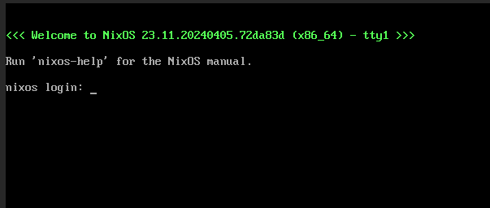
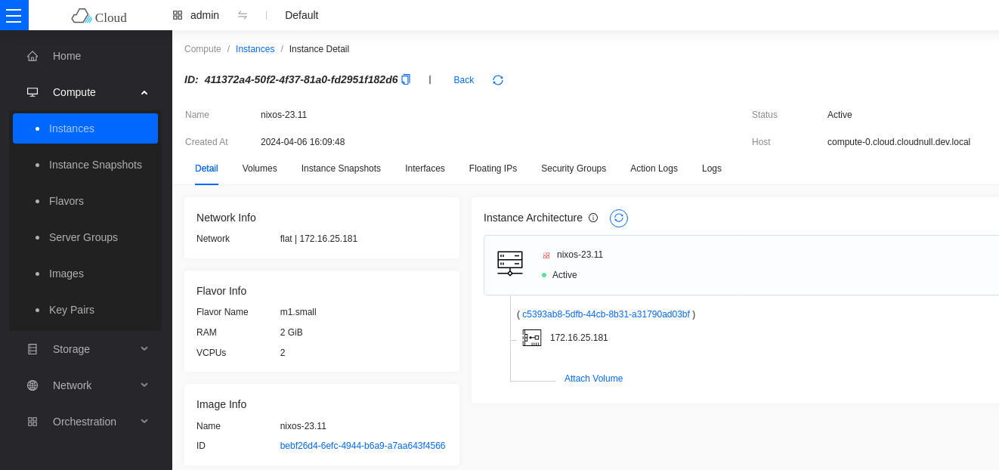
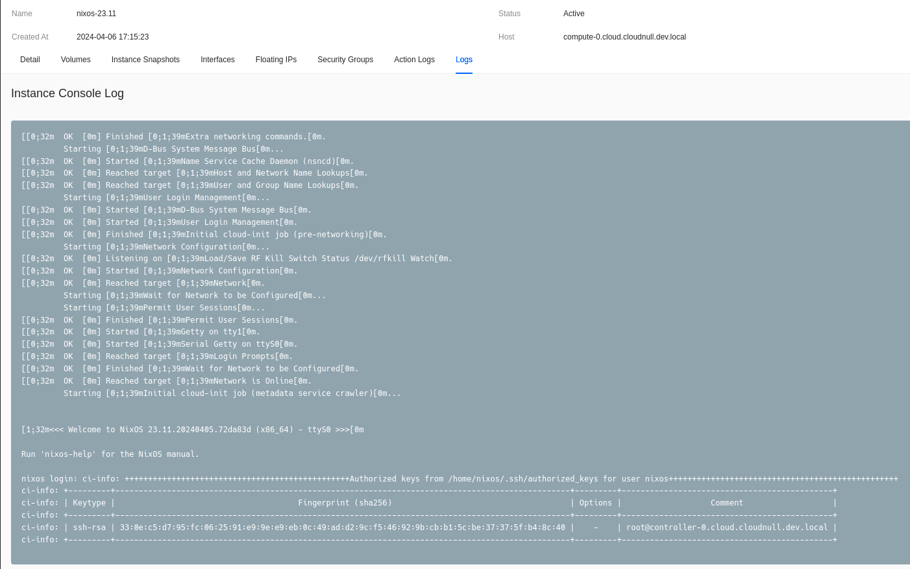

# Cloudy NixOS for OpenStack

This repository is a flake which will result in NixOS packaged up in a QCOW2 image which is compatible with virtualization platforms, like OpenStack. However you can also download the latest image built using this repository from the [releases](https://github.com/cloudnull/nixos-openstack/releases/latest) page.

> The following repo assumes you have `flakes` and `nix-command` on your system.

## Image Requirements

* UEFI boot
* Q35 machine type (compatible)
* QEMU aware
* virtio support
* Latest stable NixOS 24.11
* Latest Kernel Image (6.8+)
* Cloud-Init enabled
* Standalone system

## Running remote build

You don't have to clone this repo to build with it. The following command could be used to create your image from source online.

``` shell
nix build git+https://github.com/cloudnull/nixos-openstack#nixosConfigurations.build-qcow2.config.system.build.qcow2
```

## Running local build

If you do clone this repository, you can run the build locally from within it.

### Check the Flake

You can check the flake locally before running the build.

``` shell
nix flake check
```

### Create an OpenStack compatible image for NixOS

Run the build, this can take a few minutes.

``` shell
nix build .#nixosConfigurations.build-qcow2.config.system.build.qcow2
```

## Validate the build

After the build you will have a new qcow2 file in the results directory.

``` shell
ll result/
total 630988
-r--r--r-- 1 root root 649986048 Dec 31  1969 nixos.qcow2
dr-xr-xr-x 2 root root      4096 Dec 31  1969 nix-support
```

## Upload the image and store the result in Glance

``` shell
openstack --os-cloud default image create \
          --progress \
          --disk-format qcow2 \
          --container-format bare \
          --public \
          --file result/nixos.qcow2 \
          --property hw_scsi_model=virtio-scsi \
          --property hw_disk_bus=scsi \
          --property hw_vif_multiqueue_enabled=true \
          --property hw_qemu_guest_agent=yes \
          --property hypervisor_type=kvm \
          --property img_config_drive=optional \
          --property hw_machine_type=q35 \
          --property hw_firmware_type=uefi \
          --property os_require_quiesce=yes \
          --property os_type=linux \
          --property os_admin_user=nixos \
          --property os_distro=nixos \
          --property os_version=24.11 \
          nixos-24.11
```

This image will set the required metadata within the image properties to run the system with the desired feature set described in the "Image Requirements" section. The image output will look similar to this.

``` shell
+------------------+-------------------------------------------------------------------------------------------------------------------------------------------------------------------------------------------------------------------------+
| Field            | Value                                                                                                                                                                                                                   |
+------------------+-------------------------------------------------------------------------------------------------------------------------------------------------------------------------------------------------------------------------+
| container_format | bare                                                                                                                                                                                                                    |
| created_at       | 2024-04-06T18:31:55Z                                                                                                                                                                                                    |
| disk_format      | qcow2                                                                                                                                                                                                                   |
| file             | /v2/images/f73588c5-468e-4678-9974-33300dce7c39/file                                                                                                                                                                    |
| id               | f73588c5-468e-4678-9974-33300dce7c39                                                                                                                                                                                    |
| min_disk         | 0                                                                                                                                                                                                                       |
| min_ram          | 0                                                                                                                                                                                                                       |
| name             | nixos-24.11                                                                                                                                                                                                             |
| owner            | 4d04429679c44b9ab3cafd523b9f86fd                                                                                                                                                                                        |
| properties       | hw_disk_bus='scsi', hw_firmware_type='uefi', hw_machine_type='q35', hw_qemu_guest_agent='yes', hw_scsi_model='virtio-scsi', hw_vif_multiqueue_enabled='True', hypervisor_type='kvm', img_config_drive='optional',       |
|                  | os_admin_user='nixos', os_distro='nixos', os_hidden='False', os_require_quiesce='True', os_type='linux', os_version='24.11', owner_specified.openstack.md5='', owner_specified.openstack.object='images/nixos-24.11',   |
|                  | owner_specified.openstack.sha256=''                                                                                                                                                                                     |
| protected        | False                                                                                                                                                                                                                   |
| schema           | /v2/schemas/image                                                                                                                                                                                                       |
| status           | queued                                                                                                                                                                                                                  |
| tags             |                                                                                                                                                                                                                         |
| updated_at       | 2024-04-06T18:31:55Z                                                                                                                                                                                                    |
| visibility       | public                                                                                                                                                                                                                  |
+------------------+-------------------------------------------------------------------------------------------------------------------------------------------------------------------------------------------------------------------------+
```

> The metadata provided will ensure that OpenStack boots our image with the appropriate drivers and optimizations.

## Boot your server.

``` shell
# note the nic, flavor, and key-name will all be unique for your environment.
openstack --os-cloud default server create \
          --image nixos-24.11 \
          --nic net-id=flat \
          --flavor m1.small \
          --key-name controller-0 \
          nixos-24.11
```

The server creation will look something similar to this

``` shell
+-------------------------------------+----------------------------------------------------------+
| Field                               | Value                                                    |
+-------------------------------------+----------------------------------------------------------+
| OS-DCF:diskConfig                   | MANUAL                                                   |
| OS-EXT-AZ:availability_zone         | nova                                                     |
| OS-EXT-SRV-ATTR:host                | compute-0.cloud.local                                    |
| OS-EXT-SRV-ATTR:hypervisor_hostname | compute-0.cloud.local                                    |
| OS-EXT-SRV-ATTR:instance_name       | instance-0000004d                                        |
| OS-EXT-STS:power_state              | Running                                                  |
| OS-EXT-STS:task_state               | None                                                     |
| OS-EXT-STS:vm_state                 | active                                                   |
| OS-SRV-USG:launched_at              | 2024-04-06T18:32:18.000000                               |
| OS-SRV-USG:terminated_at            | None                                                     |
| accessIPv4                          |                                                          |
| accessIPv6                          |                                                          |
| addresses                           | flat=172.16.25.163                                       |
| adminPass                           | ************                                             |
| config_drive                        |                                                          |
| created                             | 2024-04-06T18:32:09Z                                     |
| flavor                              | m1.small (4ef01fb8-6afa-46f8-b20f-86cf60388791)          |
| hostId                              | afb64fd7a445a42c4dee560085e4dc4db3751f923ecd76f98b21c36e |
| id                                  | d212be0d-3ed0-4096-b763-b08a96fd575e                     |
| image                               | nixos-24.11 (f73588c5-468e-4678-9974-33300dce7c39)       |
| key_name                            | controller-0                                             |
| name                                | nixos-24.11                                              |
| progress                            | 0                                                        |
| project_id                          | 4d04429679c44b9ab3cafd523b9f86fd                         |
| properties                          |                                                          |
| security_groups                     | name='default'                                           |
| status                              | ACTIVE                                                   |
| updated                             | 2024-04-06T18:32:18Z                                     |
| user_id                             | 236cbdbe0eb545d68a21c58cb782c924                         |
| volumes_attached                    |                                                          |
+-------------------------------------+----------------------------------------------------------+
```

After boot all of the cloud init bits will run and we'll be able to login with our defined keypair.



## Hope this helps someone

While I'm sure I've made some mistakes, and there are ways this all could be a whole lot better, it works!



The console log is fully functional and will highlight the boot processes and anything configured by cloud-init.



The following configuration generates a simple, yet fully featured, NixOS virtual machine image (which could
probably be used with Baremetal via Ironic too... soon-tm).

Happy Nix'ing!
